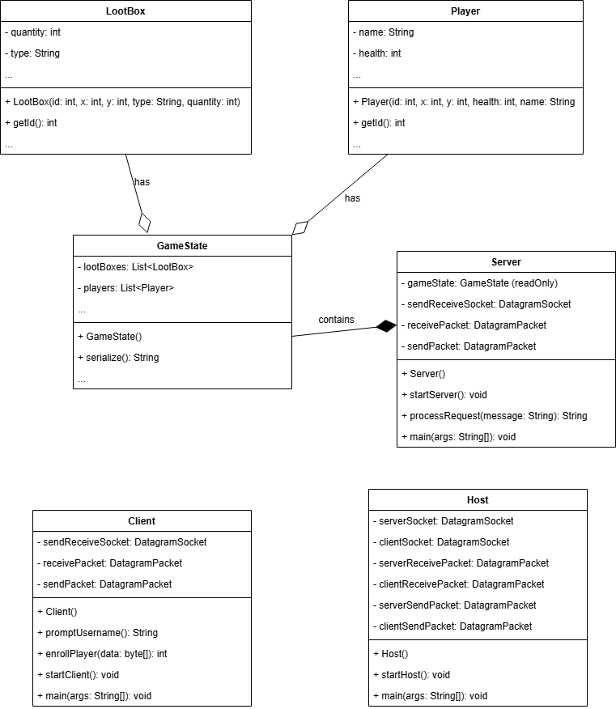

# Battle Royale UDP System

## Table of Contents
1. [Overview](#overview)
2. [Structure](#structure)
3. [Setup Guide](#setup-guide)
4. [Documentation](#documentation)
    1. [UML class diagram](#uml-class-diagram)
    2. [UML sequence diagram](#uml-sequence-diagram)
5. [Contact Information](#contact-information)

## Overview
A basic three-part system was built consisting of:
1. A Client application
2. An Intermediate Host (sometimes called a “router” or “relay”)
3. A Server application
   
The **Client** sends gameplay requests (e.g., move, pick up loot, attack) to the **Intermediate Host**,
which forwards them on to the **Server**. The **Server** processes each request (e.g., updating positions,
health, or loot availability) and sends its responses back through the **Intermediate Host**, which then
relays them to the **Client**. From the **Client**’s perspective, the Host appears to be the **Server**, and from
the Server’s perspective, the Host appears to be the **Client**. For this particular implementation, the **Intermediate 
Host** will simply forward packets without modification.

## Structure

### Client.java
- Represents the client, handles user input and sends gameplay requests to the `Host`. To which the requests
are processed by the `Server` and returned.
- Uses `DatagramSocket` to communicate with the `Host`
- Gameplay loop continues until user enters `QUIT`
### Host.java
- Represents the intermediate host, acts as a relay between `Client` and `Server`, forwarding `DatagramPackets` 
between them without modification
- Manages two `DatagramSockets` for receiving data and sending data for/to `Client` and `Server` respectively
### Server.java
- Represents the server, maintains the game state and processes requests from the `Client`, and sends to
the result to `Host` to be delivered to the `Client`
### GameState.java
- Represents the game itself, contains 3 classes within, `GameState`, `Lootbox` and `Player`

## Setup Guide
1. Clone or download the project to your computer
2. Open the project in your preferred IDE (Intellij preferred)
3. Compile the project using your IDE, build the project
4. Verify that you have a valid internet connection, as classes will not be able to communicate
5. Execute the main functions of each of the following classes below. The order of execution does not
change anything, but ensure all 3 are started and running prior to writing into client
   1. `Client`
   2. `Server`
   3. `Host`
6. Ensure that all 3 classes are started in separate terminals, if your IDE overwrites your processes and only
one class can run at a time, you must manually run them via the terminal, using this guide:
   1. Ensure you are in the correct directory hosting `Host`, `Client` and `Server`
   2. Compile all java files using:
    ```
    javac *.java
    ```
   3. Create 3 terminal instances, while still in the correct directory, start each java file in its own terminal
   ```
   java Client
   ```
   ```
   java Server
   ```
   ```
   java Host
   ```


## Expected Output
Once all 3 java files are up and running, with a valid internet connection active, all interaction will be done within
the `Client terminal`. Insert a player name, then you will be greeted with a list of commands. 
If a input guide is needed, you can find one [here](docs/test_inputs.txt) that will guide you through valid inputs.

## Documentation
Below you can find a UML sequence diagram and a UML class diagram of the system
### UML class diagram

### UML sequence diagram


## Contact Information
Mahad Ahmed
101220427